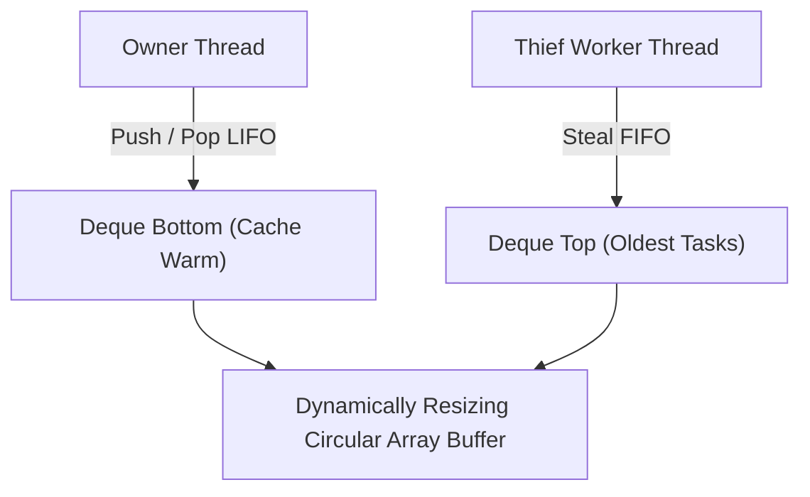

# genpark-work-stealing-thread-pool-deque-skill

Agent Skill implementing the **Chase-Lev Work-Stealing Deque Algorithm** for parallel task schedulers, supporting lock-free owner LIFO operations and stealer FIFO operations.

## Architectural Overview

